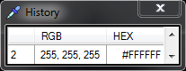

# Colour Picker
Colour Picker is (as the name suggests) a colour picker.

Colour Picker primarily works from the system tray, when the icon is double clicked your screens will have a slight grey tint applied to show that picker is active. Clicking on the colour that you want to select a popup will appear above your system tray with the RGB and HEX values, and your screens will return to normal.

Right clicking on the icon gives the options for History And Exit.

The history window sits on-top-of all other windows for easy access. It shows all previous colours selected since the program was started in both RGB and HEX. Double clicking on the values copies it into your clipboard for easy access.

