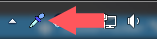
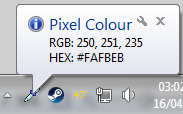

# colourPicker
Colour Picker is (as the name sugests) a colour picker.

Colour Picker primarily works from the system tray, when the icon is double clicked you can then click anywhere on the primary screen to select the colour under the cursor. This will copy the hexadecimal value into the clipboard and show a popup containing the RGB and HEX values. Right clicking on the icon shows a list containg options and exit. The options window currently only shows the previously selected pixel colour.

